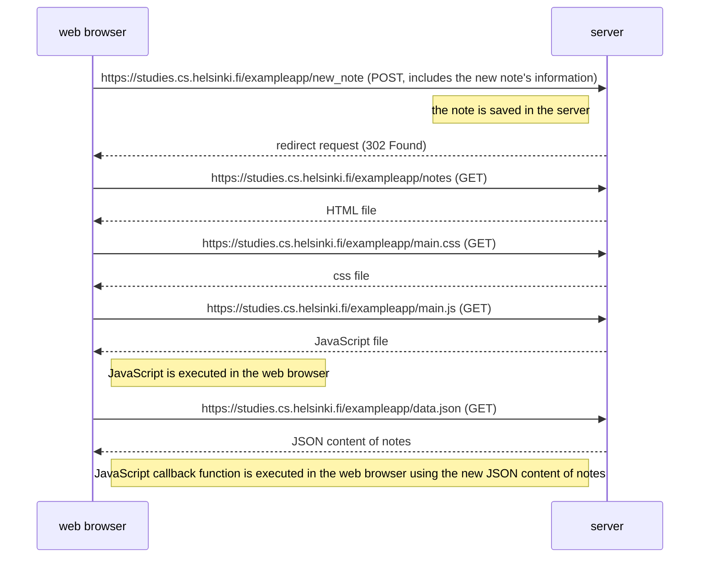

```mermaid
sequenceDiagram
    web browser->>server: https://studies.cs.helsinki.fi/exampleapp/new_note (POST, includes the new note's information)
    Note left of server: the note is saved in the server
    server-->>web browser: redirect request (302 Found)
    web browser->>server: https://studies.cs.helsinki.fi/exampleapp/notes (GET)
    server-->>web browser: HTML file
    web browser->>server: https://studies.cs.helsinki.fi/exampleapp/main.css (GET)
    server-->>web browser: css file
    web browser->>server: https://studies.cs.helsinki.fi/exampleapp/main.js (GET)
    server-->>web browser: JavaScript file
    Note right of web browser: JavaScript is executed in the web browser
    web browser->>server: https://studies.cs.helsinki.fi/exampleapp/data.json (GET)
    server-->>web browser: JSON content of notes
    Note right of web browser: JavaScript callback function is executed in the web browser using the new JSON content of notes
```
